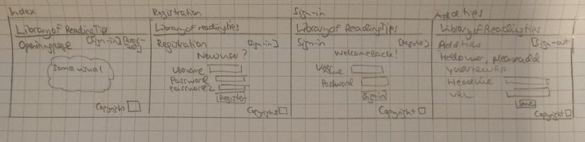

# Ohtu-miniprojekti-2021 - Library of Reading Tips

## Application purpose

Purpose of the **Library of Reading Tips** application is to store links to useful reading materials - books, websites, podcasts, etc - related to computer science.

## User Groups

At the start, there is type of role in the application, i.e. a normal user.

## User Interface Draft

First draft of the user interface is below.



## Basic Version Functionalities

- User can open a website of Library of Reading tips.
- User can create a new account to the application
- User can sign-in to the library, if he/she already has an account
- User can create a reading tip, in the first version creating a headline for the tip and adding a URL to the headline.

## Future Development Ideas

- User can see the tips they have added
- User can re-order the tips they have added
- User can modify the tips they have added

See the product and sprint backlog in [Google Docs](https://docs.google.com/spreadsheets/d/1plecnq6NQp5lWElzSjdFOGPEqjY1rucBk0Hdp8Kfcho/edit?usp=sharing).

## Definition of Done

Definition of done the user stories in general is the following:

- Tasks are completed
- Tests are done and passed
- Updated and working application is running on Heroku

## Installation and Running

To install the application you need a working Python and Poetry installation.

```bash
git clone https://github.com/secnec/ohtu-miniprojekti-2021.git
cd ohtu-miniprojekti-2021
poetry install
```

Before running the application you must set the database URL and the secret key to something unique for Flask. If you do not have a database installed, you can try to use `sqlite://`, which should create a database in-memory.

```bash
export DATABASE_URL=sqlite://
export SECRET_KEY=SetMeToSomethingSecret
```

To run the application from command line:

```bash
poetry run flask run
```

Alternatively:

```bash
poetry shell
flask run
```

The application's continuous integration is run through [GitHub Actions](https://github.com/secnec/ohtu-miniprojekti-2021/actions).

The application will be available in [Heroku](https://library-of-reading-tips.herokuapp.com/).

The application is licensed under [Creative Commons CC BY-NC-SA 3.0](https://creativecommons.org/licenses/by-nc-sa/3.0/)
